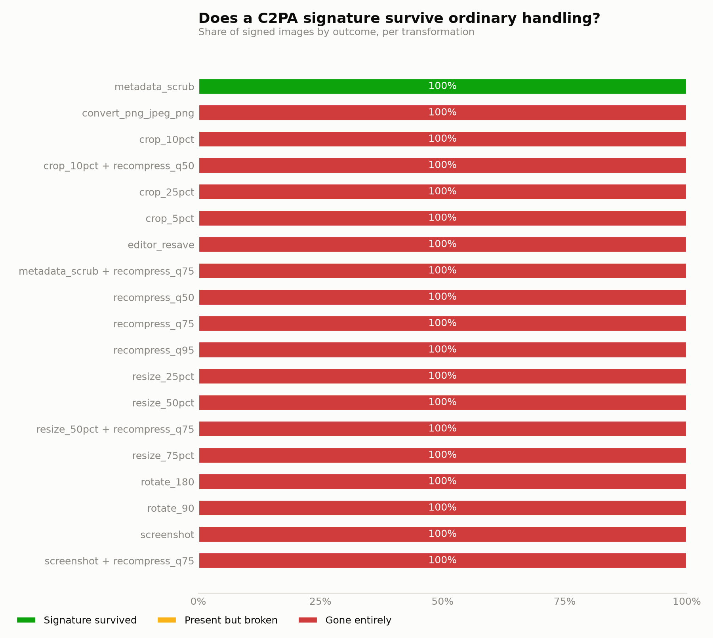

# Result tables

Generated by `python -m src.report` from `data/results/runs.csv`. Do not edit by hand.

- Corpus images tested: **3** (**1** carrying a valid C2PA manifest to begin with)
- Local transform experiments: **60**
- Platform round-trips: **0**

Survival rates below count only images that started with a valid manifest. An image with nothing to lose cannot lose it.

## C2PA survival by transform

| Transform | n | Survived | Broken | Gone | Survival rate |
|---|---:|---:|---:|---:|---:|
| metadata_scrub | 1 | 1 | 0 | 0 | 100% |
| convert_png_jpeg_png | 1 | 0 | 0 | 1 | 0% |
| crop_10pct | 1 | 0 | 0 | 1 | 0% |
| crop_10pct then recompress_q50 | 1 | 0 | 0 | 1 | 0% |
| crop_25pct | 1 | 0 | 0 | 1 | 0% |
| crop_5pct | 1 | 0 | 0 | 1 | 0% |
| editor_resave | 1 | 0 | 0 | 1 | 0% |
| metadata_scrub then recompress_q75 | 1 | 0 | 0 | 1 | 0% |
| recompress_q50 | 1 | 0 | 0 | 1 | 0% |
| recompress_q75 | 1 | 0 | 0 | 1 | 0% |
| recompress_q95 | 1 | 0 | 0 | 1 | 0% |
| resize_25pct | 1 | 0 | 0 | 1 | 0% |
| resize_50pct | 1 | 0 | 0 | 1 | 0% |
| resize_50pct then recompress_q75 | 1 | 0 | 0 | 1 | 0% |
| resize_75pct | 1 | 0 | 0 | 1 | 0% |
| rotate_180 | 1 | 0 | 0 | 1 | 0% |
| rotate_90 | 1 | 0 | 0 | 1 | 0% |
| screenshot | 1 | 0 | 0 | 1 | 0% |
| screenshot then recompress_q75 | 1 | 0 | 0 | 1 | 0% |

## C2PA survival by platform

_No platform round-trips logged yet. See `docs/PLATFORM-PROTOCOL.md`._

## EXIF survival, for comparison

| Transform | EXIF retained |
|---|---:|
| convert_png_jpeg_png | 0% |
| crop_10pct | 0% |
| crop_10pct then recompress_q50 | 0% |
| crop_25pct | 0% |
| crop_5pct | 0% |
| editor_resave | 0% |
| metadata_scrub | 0% |
| metadata_scrub then recompress_q75 | 0% |
| recompress_q50 | 0% |
| recompress_q75 | 0% |
| recompress_q95 | 0% |
| resize_25pct | 0% |
| resize_50pct | 0% |
| resize_50pct then recompress_q75 | 0% |
| resize_75pct | 0% |
| rotate_180 | 0% |
| rotate_90 | 0% |
| screenshot | 0% |
| screenshot then recompress_q75 | 0% |
